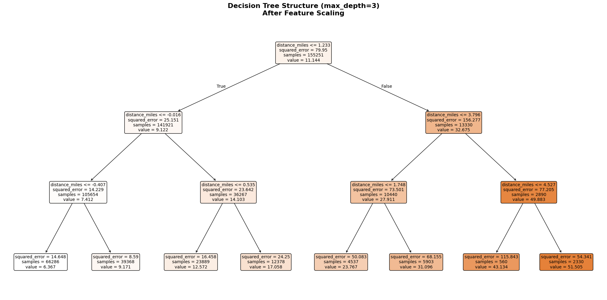
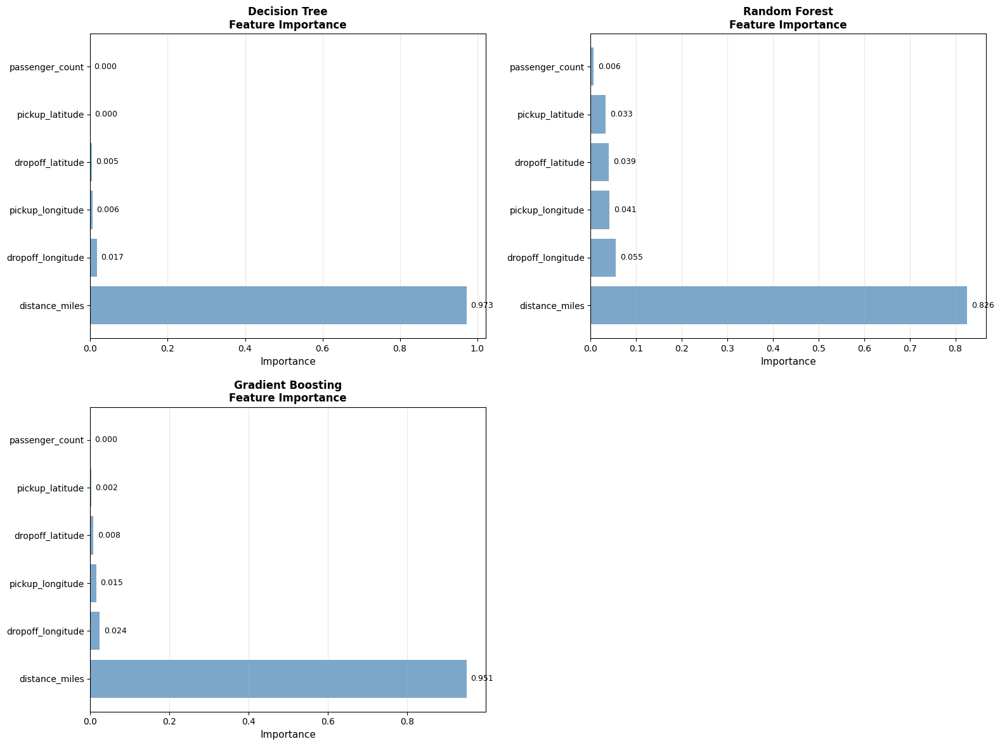
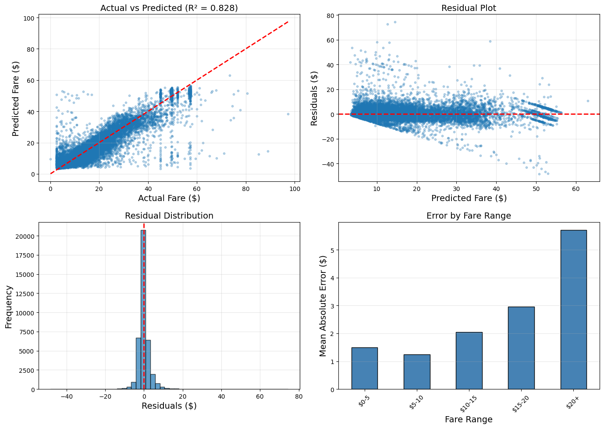
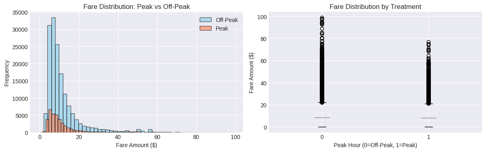

# Uber Fare Analysis: Prediction + Causal Inference

End-to-end data science project on NYC Uber fares with two workflows:
1. fare prediction (supervised regression)
2. causal inference (treatment-effect estimation)

## Project Scope

### 1) Fare prediction notebook
`01_fare_prediction/uber_fare_prediction.ipynb`
- data profiling and cleaning
- geospatial/time feature engineering
- model training and comparison (Linear, Random Forest, Gradient Boosting)
- residual analysis and test-set evaluation

### 2) Causal inference notebook
`02_causal_inference/causal_inference_analysis.ipynb`
- treatment 1: peak-hour indicator
- treatment 2: high passenger-count indicator (3+)
- CausalML meta-learners + DoWhy causal estimation
- robustness/refutation checks

## Key Findings

- Distance is the strongest fare driver in both predictive and causal pipelines.
- Peak-hour treatment has a consistent positive causal effect (about +$0.15 in current notebook outputs).
- Passenger-count treatment pipeline is implemented and can be rerun to produce final numeric estimates from Part 6.

## Results Visuals

### Fare Prediction







### Causal Inference





## Data Requirements

Source: [NYC Taxi Fare Prediction (Kaggle)](https://www.kaggle.com/competitions/new-york-city-taxi-fare-prediction)

Expected files in the project root:
- `uber.csv.zip` (or extracted `uber.csv`) for notebook 1
- `uber_cleaned.csv` for notebook 2 (created in notebook 1 preprocessing)

## Repository Structure

```text
uber-fare-analysis/
|-- 01_fare_prediction/
|   `-- uber_fare_prediction.ipynb
|-- 02_causal_inference/
|   `-- causal_inference_analysis.ipynb
|-- VISUALIZATION_GUIDE.txt
|-- requirements.txt
|-- .gitignore
|-- LICENSE
`-- README.md
```

## Setup + Run

1. Clone:
```bash
git clone https://github.com/MaralVahedi/uber-fare-analysis.git
cd uber-fare-analysis
```

2. Install dependencies:
```bash
python -m pip install -r requirements.txt
```

3. Add data files (`uber.csv.zip` / `uber.csv`, then `uber_cleaned.csv`).

4. Run notebooks in order:
- `01_fare_prediction/uber_fare_prediction.ipynb`
- `02_causal_inference/causal_inference_analysis.ipynb`

## Skills Demonstrated

- structured exploratory data analysis
- feature engineering (geospatial + temporal)
- regression modeling and error analysis
- causal effect estimation (CausalML, DoWhy)
- robustness testing and interpretation

## Contact

Maral Vahedi
- LinkedIn: [linkedin.com/in/maralvahedi](https://linkedin.com/in/maralvahedi)
- Email: maral.vahedi@mail.mcgill.ca
