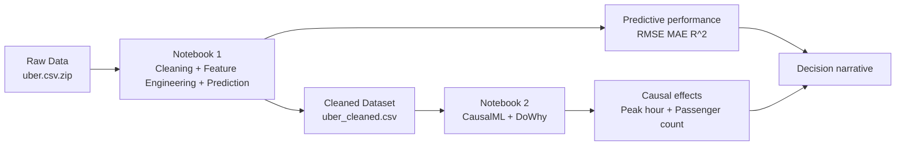
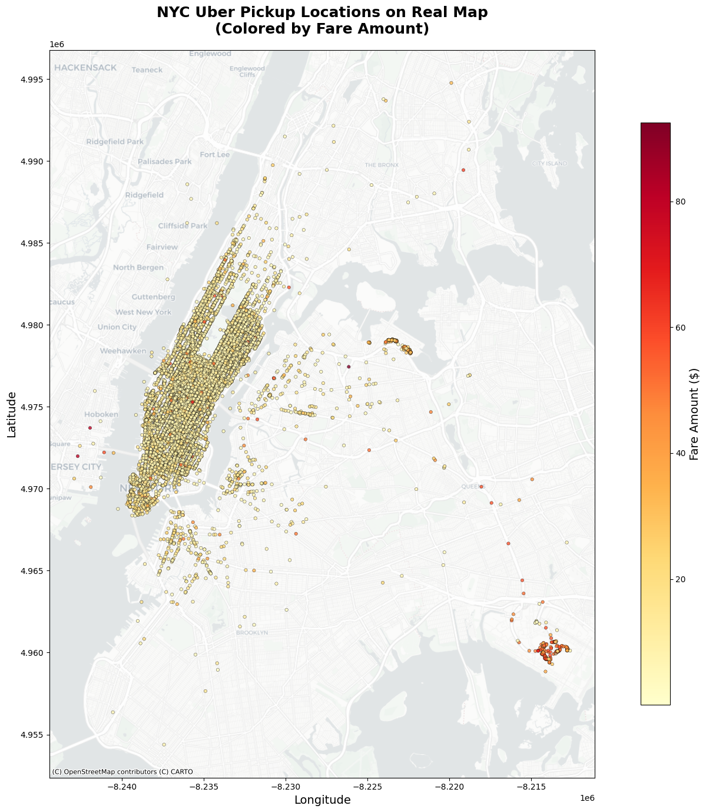
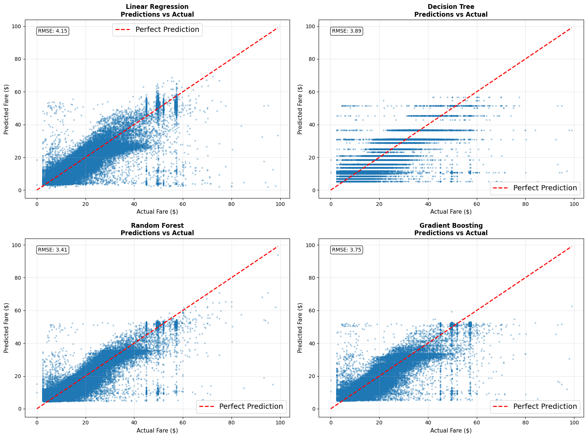
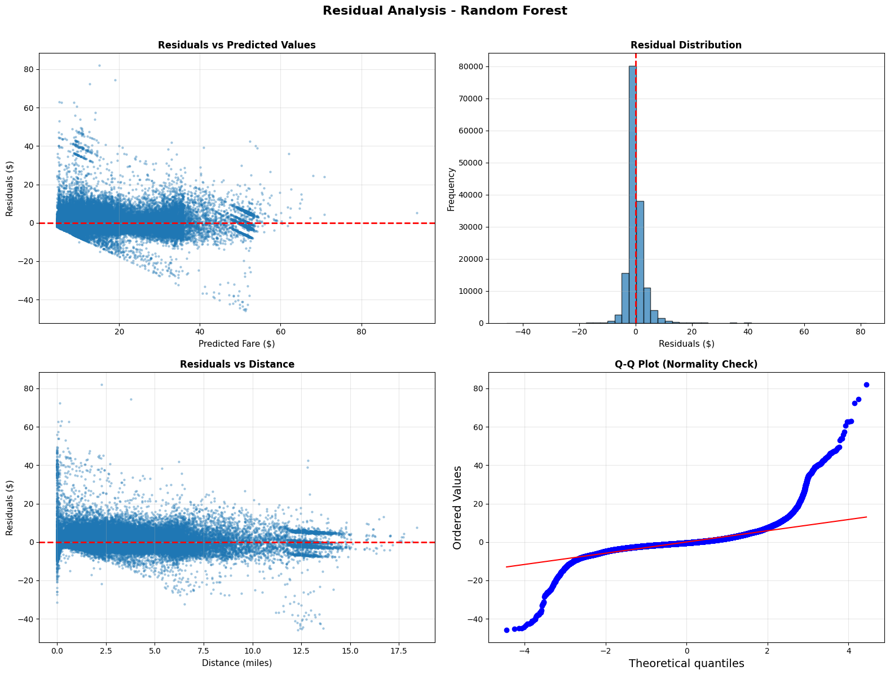
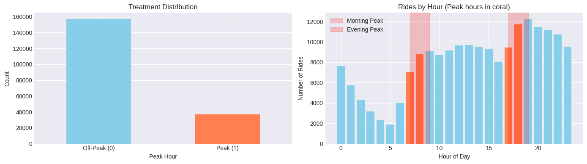
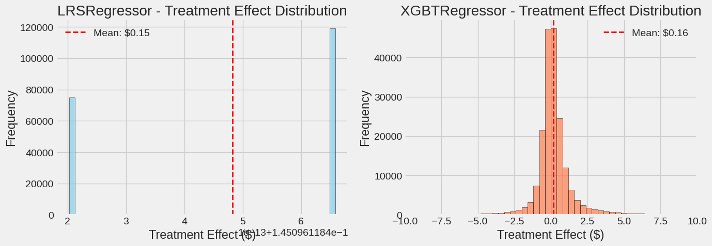

# Uber Fare Analysis: A Data Science Case Study (Prediction + Causal Inference)

This repository is built as a full data science narrative, not only a model report.
It answers two linked questions on NYC Uber fares:

1. How well can fare be predicted from observable trip attributes?
2. Which factors have measurable causal impact on fare after controlling confounders?

---

## 1) Why This Problem Matters

Fare estimation affects multiple stakeholders:

| Stakeholder | Pain Point | Data Science Value |
|---|---|---|
| Riders | Price uncertainty before booking | Better expected fare estimates |
| Pricing/Product teams | Hard to distinguish correlation vs causation | More reliable policy decisions |
| Operations | Need interpretable demand/pricing signals | Understand when/why fares move |

If we only optimize prediction, we may build accurate models but still misread business levers.
If we only run causal analysis, we may miss operational forecasting value.
This project intentionally combines both.

---

## 2) Business Questions and Hypotheses

| Question | Hypothesis |
|---|---|
| Q1: Does peak-hour timing increase fare? | Peak windows may raise fares through demand and congestion effects. |
| Q2: Does higher passenger count (3+) increase fare? | Larger group rides may have slightly higher fares due to trip/vehicle mix. |

---

## 3) End-to-End Workflow

### Notebook map

| Notebook | Role in the story | Primary output |
|---|---|---|
| `01_fare_prediction/uber_fare_prediction.ipynb` | Build predictive baseline and validate feature signal | Error metrics + diagnostics |
| `02_causal_inference/causal_inference_analysis.ipynb` | Estimate treatment effects with multiple causal methods | Robust ATE estimates |

### Mini architecture / pipeline



### How to read this repo
1. Start with Notebook 1 to understand data quality controls and predictive validity.
2. Move to Notebook 2 to test causal claims under explicit assumptions.
3. Use the final comparison to separate forecasting usefulness from true levers.

---

## 4) Data + Quality Controls

Source: [NYC Taxi Fare Prediction (Kaggle)](https://www.kaggle.com/competitions/new-york-city-taxi-fare-prediction)

Core cleaning logic (Notebook 1):
- remove invalid fares (`fare_amount <= 0` or `> 100`)
- enforce NYC coordinate bounds
- keep realistic passenger counts (`1-6`)
- remove missing critical fields

### Why this matters
Model quality is very sensitive to geospatial outliers.  
Before modeling, I validate that pickup locations align with NYC geography.



Interpretation:
- pickup density clusters in expected NYC regions
- cleaning rules remove implausible geo points
- spatial pattern supports distance/location as strong fare signals

---

## 5) Notebook 1: Predictive Modeling

### Modeling strategy
- baseline + tree ensembles
- tuned model selection via RMSE
- holdout test evaluation
- residual diagnostics for error behavior

### Model comparison (RMSE)

| Model | RMSE | Status |
|---|---:|---|
| Linear Regression | 3.45 | Baseline |
| Random Forest | 2.85 | Default |
| **Random Forest** | **2.78** | **Tuned and selected** |
| Gradient Boosting | 2.92 | Default |
| Gradient Boosting | 3.66 | Tuned |



### Held-out performance

| Metric | Value |
|---|---:|
| RMSE | 3.718 |
| MAE | 2.014 |
| R^2 | 0.828 |

Residual checks show near-zero average bias with wider spread on higher-fare trips.



---

## 6) Notebook 2: Causal Inference

Prediction alone does not prove drivers of fare change.
So Notebook 2 estimates treatment effects using complementary causal methods.

### Treatments

| Treatment | Definition | Controlled confounders |
|---|---|---|
| Peak hour | 7-9 AM or 5-7 PM | Distance, hour/day signals, pickup/dropoff location |
| High passenger count | `passenger_count >= 3` | Distance, time, pickup/dropoff location |



### Causal summary

| Treatment | CausalML | DoWhy | Readout |
|---|---|---|---|
| Peak hour | ~0.15 to 0.16 | ~0.15 to 0.16 (core methods) | Clear positive effect |
| High passenger count | LRS: 0.121, XGB: 0.132 | Avg: 0.118 (range 0.090 to 0.154) | Small positive effect |



### Interpretation
- both treatments are positive after adjustment
- peak-hour effect is stronger than passenger-count effect
- distance remains dominant across predictive and causal views

---

## 7) Business Impact

| Area | Practical implication |
|---|---|
| Rider transparency | MAE around $2 provides a useful expected-fare range before booking |
| Pricing strategy | Peak-hour timing appears to have stronger direct impact than passenger count |
| Product decisions | Supports prioritizing time/location-aware pricing explanations and UX |
| Analytics maturity | Demonstrates correlation-to-causation upgrade for decision quality |

In short: this project provides both operational forecasting value and causal decision support.

---

## 8) Assumptions, Limits, and Next Steps

### Key assumptions
- no major unobserved confounders beyond included controls
- treatment definitions (binary peak hour, binary passenger threshold) are reasonable simplifications

### Current limitations
- weather/events/traffic shocks are not directly modeled
- sensitivity to method choice exists in propensity-based estimators

### Next improvements
- add weather and event covariates
- estimate heterogeneous treatment effects by zone/time cluster
- include uncertainty intervals in final decision dashboard format

---

## 9) Reproducibility

```bash
git clone https://github.com/MaralVahedi/uber-fare-analysis.git
cd uber-fare-analysis
python -m pip install -r requirements.txt
```

Place data files in project root:
- `uber.csv.zip` (or extracted `uber.csv`) for Notebook 1
- `uber_cleaned.csv` for Notebook 2

Run in order:
1. `01_fare_prediction/uber_fare_prediction.ipynb`
2. `02_causal_inference/causal_inference_analysis.ipynb`

---

## 10) Data Science Competencies Demonstrated

| Competency | Evidence in project |
|---|---|
| Problem framing | explicit business + causal questions |
| Data quality management | domain-based cleaning and validation |
| Feature engineering | geospatial and temporal signal construction |
| Predictive modeling | model selection, tuning, diagnostics |
| Causal reasoning | multiple estimators + method comparison |
| Communication | narrative from data to decision implications |

---

## Contact

Maral Vahedi
- LinkedIn: [linkedin.com/in/maralvahedi](https://linkedin.com/in/maralvahedi)
- Email: maral.vahedi@mail.mcgill.ca
